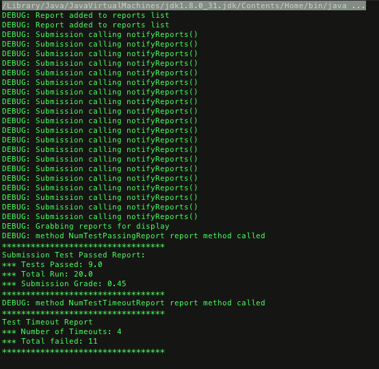

Team: John Luke Bucuvalas, Zack Doyle, Brandon Mikulka


Problem 1
==========

This problem uses the singleton pattern.  The ultimate goal is to ensure that there is only ever a single queue created for homework submissions.  The singleton pattern accomplishes this.  The submission looks for the queue, if there is one created, it retrieves the single instance of that queue, otherwise it creates a new queue. From here submissions may be added and processed using that queue.

[DIAGRAM ON NEXT PAGE]
\pagebreak

###Problem Work Breakdown:

| Percent | Name                | Work Done on this problem                              |
| ------- | -----------------   | -------------------------                              |
| 25%     | John Luke Bucuvalas | Looked over, discussed and approved, wrote writeup     |
| 35%     | Zack Doyle          | Began implementation, looked over and approved         |
| 40%     | Brandon Mikulka     | Commented, implemented design pattern, created diagram & pdf |

###Example Run


###Code:

```Java
public class Problem1Driver {
    public static void main(String[] args) {
        Submission submission1 = new Submission();
        Submission submission2 = new Submission();
        Submission submission3 = new Submission();
        Submission submission4 = new Submission();
        Submission submission5 = new Submission();
        Submission submission6 = new Submission();

        SubmissionQueue queue = SubmissionQueue.getInstance();

        queue.add(submission1);
        queue.add(submission2);
        queue.add(submission3);
        queue.add(submission4);

        queue.process();
        queue.process();

        SubmissionQueue queue2 = SubmissionQueue.getInstance();

        queue2.add(submission5);
        queue2.add(submission6);

        queue2.process();
        queue2.process();
        queue2.process();
        queue2.process();

    }
}


import java.util.Random;

public class Submission
{
    private static Random rand = new Random();
    private int id;

    public Submission()
    {
    // Give this submission a unique(ish) id
        id = rand.nextInt(10000000);
    }

    public int getId(){
        return id;
    }
}

import java.util.LinkedList;
import java.util.NoSuchElementException;

public class SubmissionQueue
{
  private LinkedList<Submission> internalQueue;
    private static SubmissionQueue queue;

    private SubmissionQueue(){
        internalQueue = new LinkedList<Submission>();

    }

    public static SubmissionQueue getInstance(){
        if (queue == null){
            System.out.println("Creating new instance of SubmissionQueue");
            queue = new SubmissionQueue();
        }
        else{
            System.out.println("Using already instantiated Queue");
        }
        return queue;
    }

  public synchronized boolean add(Submission submission){
    System.out.println("Adding Submission with id " + submission.getId());
        return internalQueue.add(submission);
  }

    public boolean process() {
        Submission target = getNextSubmission();
        if (target != null){
            System.out.println("Processing Submission with id " + target.getId());
            return true;
        }
        return false;
    }

    private synchronized Submission getNextSubmission(){
        Submission target;
        try {
            target = internalQueue.remove();
            return target;
        }
        catch(NoSuchElementException e){
            System.err.println("Caught NoSuchElementException: " + e.getMessage());
            return null;
        }
    }
}
```


Problem 2
=========
This problem uses the observer pattern.  In this case, the reports observe the submission.  The two reporter classes implement a reporter interface class (iReporter), which ensures that any class that implements the interface contains the notifyTestResult() method. When a test case is run in the submission class, it sets whether the last test passed and whether the timeout failed.  The submission then uses the interface’s method to inform its report classes that a test has been run.  The report classes have the knowledge in their notifyTestResult() method to correctly process the results of the test.

[DIAGRAM ON NEXT PAGE]
\pagebreak

###Problem Work Breakdown:

| Percent | Name                | Work Done on this problem                  |
| ------- | -----------------   | -------------------------                  |
| 50%     | John Luke Bucuvalas | Implemented design pattern and did writeup |
| 15%     | Zack Doyle          | Reviewed code and worked to help fix       |
| 35%     | Brandon Mikulka     | Worked to fix pattern, created diagram & pdf |


###Example Run



###Code:

```Java

import java.util.Random;
import java.util.*;

interface ISubmission{
    public abstract void addReport(iReporter r);
    public abstract void removeReport(iReporter r);
    public abstract void notifyReports();
}

public class Submission implements ISubmission
{
    private Random myRandom;
    private List<iReporter> reports;
    private boolean lastTestPassed;
  private boolean lastErrorWasTimeout;

    // You may add attributes to this class if necessary

  public Submission()
  {
      myRandom = new Random();
    lastErrorWasTimeout = false;
    reports = new ArrayList<iReporter>();
  }

    public void runTestCase()
  {
      // For now, randomly pass or fail, possibly due to a timeout
    boolean passed = myRandom.nextBoolean();
    lastTestPassed = passed;
    if(!passed)
    {
        lastErrorWasTimeout = myRandom.nextBoolean();
    }
        System.out.println("DEBUG: Submission calling notifyReports()");
        notifyReports();
  }

    public boolean wasTimeoutError()
  {
      return lastErrorWasTimeout;
  }
  public boolean didTestPass()
  {
    return lastTestPassed;
  }

    @Override
    public void addReport(iReporter r){
        System.out.println("DEBUG: Report added to reports list");
        reports.add(r);

  }
    @Override
    public void removeReport(iReporter r){
        int i = reports.indexOf(r);
        if (i >= 0) {
            reports.remove(i);
        }
    }

    @Override
  public void notifyReports(){
    for (iReporter i : reports){
      i.notifyTestResult();
    }
  }

  public void report(){
        System.out.println("DEBUG: Grabbing reports for display");
        for (iReporter i : reports){
      i.report();
    }
  }

  public void runTests(){
    runTests(20);
  }

  public void runTests(int numTests){
    for (int i = 0; i < numTests; i++){
      runTestCase();
    }
  }

  public static void main(String[] args){
    Submission testSubmission = new Submission();
        new NumTestsPassedReport(testSubmission);
        new NumTestsTimeoutReport(testSubmission);

    testSubmission.runTests();
    testSubmission.report();
  }
}


interface iReporter
{

  public abstract void report();
  public abstract void notifyTestResult();
}


class NumTestsPassedReport implements iReporter
{
  private double passed;
  private double totalRun;
  private Submission submission;

  NumTestsPassedReport(Submission submission){
    passed = 0;
    totalRun = 0;
    this.submission = submission;
        this.submission.addReport(this);
  }

  public void report(){
        System.out.println("DEBUG: method NumTestPassingReport report method called");
        System.out.println("**********************************");
    System.out.println("Submission Test Passed Report: ");
    System.out.println("*** Tests Passed: " + passed);
    System.out.println("*** Total Run: " + totalRun);
    double grade = passed/totalRun;
    System.out.println("*** Submission Grade: " + grade);
    System.out.println("**********************************");
  }

    // Observer Update
  public void notifyTestResult(){
    boolean lp = submission.didTestPass();
    if (lp) passed ++;
    totalRun ++;

    }
}

class NumTestsTimeoutReport implements iReporter
{
  private int timedOut;
  private int numFailed;
  private Submission submission;

  public NumTestsTimeoutReport(Submission submission){
    timedOut = 0;
    numFailed = 0;
    this.submission = submission;
        this.submission.addReport(this);
  }
  public void report(){
        System.out.println("DEBUG: method NumTestTimeoutReport report method called");
    System.out.println("**********************************");
    System.out.println("Test Timeout Report");
    System.out.println("*** Number of Timeouts: " + timedOut);
    System.out.println("*** Total failed: " + numFailed);
    System.out.println("**********************************");
  }

    // Observer Update
  public void notifyTestResult(){
    boolean lt = submission.wasTimeoutError();
    boolean lp = submission.didTestPass();
    if (!lp){
      numFailed ++;
      if (lt){
        timedOut ++;
      }
    }
  }
}
```

Problem 3
=========
This problem uses the factory pattern.  Originally the driver contained a multiline if-statement to create the proper sort of logger.  This if-statement would need to be repeated  wherever the client might want to create a logger.   Instead, the factory takes the wanted type of logger in and returns the proper new logger.  This makes the client-side implementation much simpler.

[DIAGRAM ON NEXT PAGE]
\pagebreak

###Problem Work Breakdown:

| Percent | Name                | Work Done on this problem                  |
| ------- | -----------------   | -------------------------                  |
| 60%     | John Luke Bucuvalas | Implemented design pattern and did writeup |
| 5%      | Zack Doyle          | Reviewed code                              |
| 25%     | Brandon Mikulka     | Reviewed code, created diagram & pdf       |


###Example Run


###Code:

```Java
interface Logging
{
  public void log(String msg);
}

class LogText implements Logging
{
  public LogText()
  {
    System.out.println("Logging: text format");
  }
  public void log(String msg)
  {
    System.out.println("Logging text to file: " + msg);
  }
}
class LogXML implements Logging
{
  public LogXML()
  {
    System.out.println("Logging: <type>XML Format</type>");
  }
  public void log(String msg)
  {
    System.out.println("Logging xml to file: log.xml" );
    System.out.println("<xml><msg>"+msg+"</msg></xml>");
  }
}
class LogHTML implements Logging
{
  public LogHTML()
  {
    System.out.println("Logging: HTML format");
  }
  public void log(String msg)
  {
    System.out.println("Logging HTML to file: log.html" );
    System.out.println("<html><body>"+msg+"</body></html>");
  }
}

class LoggingFactory
{
  public static Logging createLogging(String type){
        System.out.println("Factory creating 'Logging' of type = [" + type + "]");
        if (type.equalsIgnoreCase("text"))
      return new LogText();
    else if (type.equalsIgnoreCase("xml"))
      return new LogXML();
    else if (type.equalsIgnoreCase("html"))
      return new LogHTML();
    else
      return new LogText();
  }

}

class Analysis
{
  public static void main(String[] args)
  {
    if (args.length != 1)
    {
      System.out.println("Usage: java Analysis type");
      System.exit(-1);
    }
    String type = args[0];
    Logging logfile = LoggingFactory.createLogging(type);
    logfile.log("Starting application...");

    logfile.log("... read in data file to analyze ...");
    // code...
    logfile.log("... Clustering data for analysis ...");
    // code...
    logfile.log("... Printing analysis results ...");
    // code...
  }
}

```

Problem 4
=========
This problem uses the flyweight pattern.  When a certain type of tree is requested, if that tree does not already exist, then the image is read from the file.  However, if the tree does exist the image is drawn from the already existing map of images.  This means that each image is only read in once, a much lighter way of drawing thousands of trees.

[DIAGRAM ON NEXT PAGE]
\pagebreak

###Problem Work Breakdown:

| Percent | Name                | Work Done on this problem                         |
| ------- | -----------------   | -------------------------                         |
| 35%     | John Luke Bucuvalas | Reviewed Code, helped fix, and did writeup        |
| 5%      | Zack Doyle          | Reviewed code                                     |
| 60%     | Brandon Mikulka     | Implemented design pattern, created diagram & pdf |


###Example Run (on next page)


###Code:

```Java
import java.util.*;
import java.io.*;
import java.awt.*;
import javax.swing.*;
import javax.imageio.*;

interface Terrain
{
  void draw(Graphics graphics, int x, int y);
}
class Tree implements Terrain {
    private Image image;

    public Tree(String type) {
        System.out.println("Creating a new instance of a tree of type " + type);
        String filename = "tree" + type + ".png";
        try {
            image = ImageIO.read(new File(filename));
        } catch (Exception exc) {
            System.out.println("Could not read filename " + filename);
        }
    }

    @Override
    public void draw(Graphics graphics, int x, int y) {
        graphics.drawImage(image, x, y, null);
    }
}
class TreeFactory
{
  private static final Map<String, Terrain> treeFlyweights = new HashMap<String,Terrain>();
  public static Terrain getTree(String type)
    {
        //Implement Factory Design Pattern
        Terrain terrain = treeFlyweights.get(type);

        if (terrain == null){
            terrain = new Tree(type);
            treeFlyweights.put(type, terrain);
        }
        else{
            System.out.println(type + " Tree already cached in Hash. Returning cached tree.");
        }

        return terrain;
   }
}
/**
 * Don’t change anything in TreeDemo
 */
class TreeDemo extends JPanel
{
  private static final int width = 800;
  private static final int height = 700;
  private static final int numTrees = 50;
  private static final String type[] = { "Apple", "Lemon", "Blob", "Elm", "Maple" };

  public void paint(Graphics graphics)
  {
    for(int i=0; i < numTrees; i++)
    {
      Tree tree = (Tree)TreeFactory.getTree(getRandomType());
      tree.draw(graphics, getRandomX(width), getRandomY(height));
    }
  }
  public static void main(String[] args)
  {
    JFrame frame = new JFrame();
    frame.add(new TreeDemo());
    frame.setSize(width, height);
    frame.setDefaultCloseOperation(JFrame.EXIT_ON_CLOSE);
    frame.setVisible(true);
  }
  private static String getRandomType()
  {
    return type[(int)(Math.random()*type.length)];
  }
  private static int getRandomX(int max)
  {
    return (int)(Math.random()*max );
  }
  private static int getRandomY(int max)
  {
    return (int)(Math.random()*max);
  }
}

```
